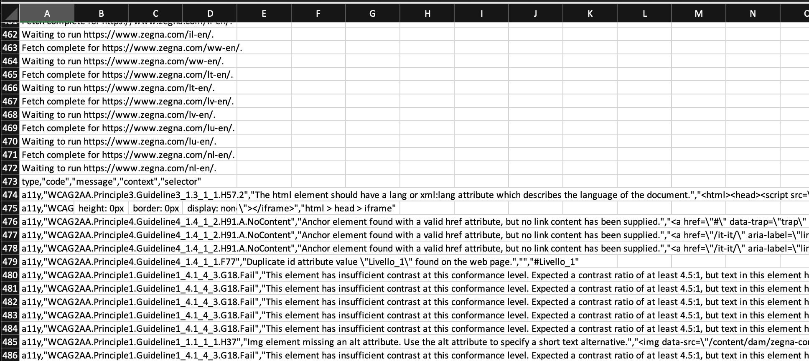
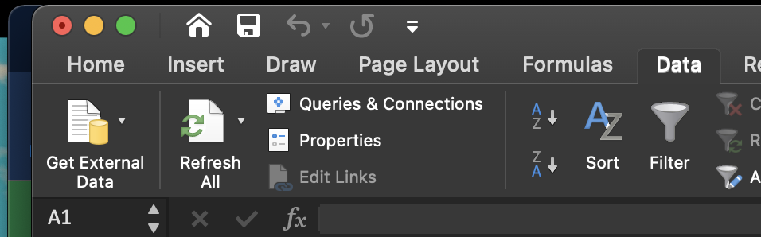
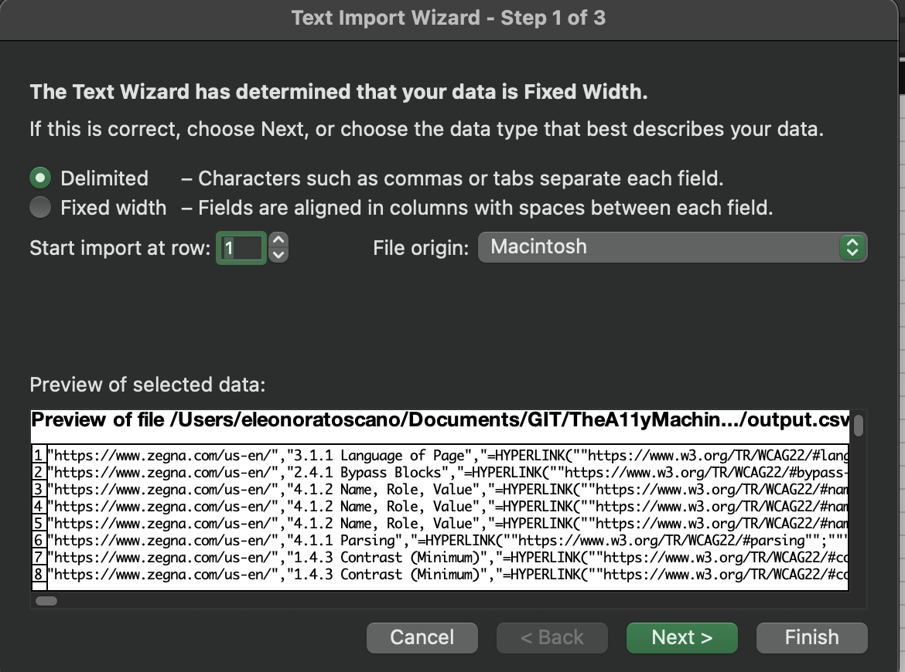
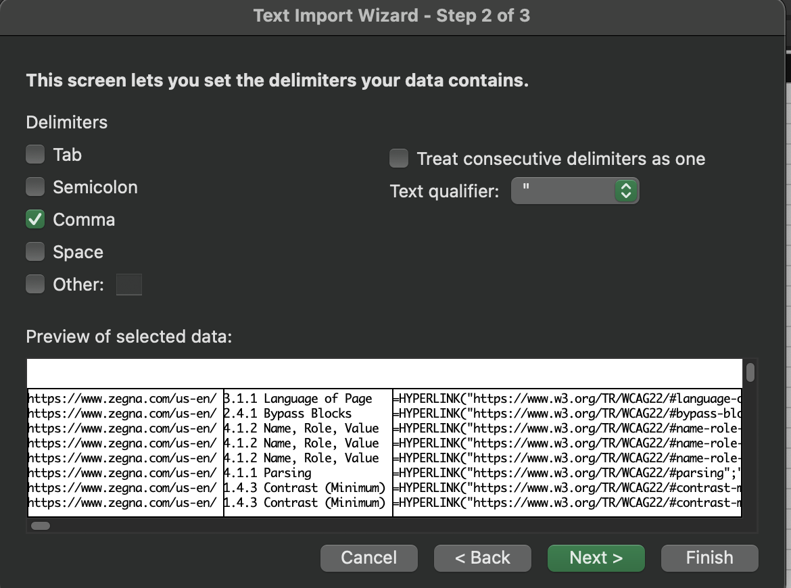
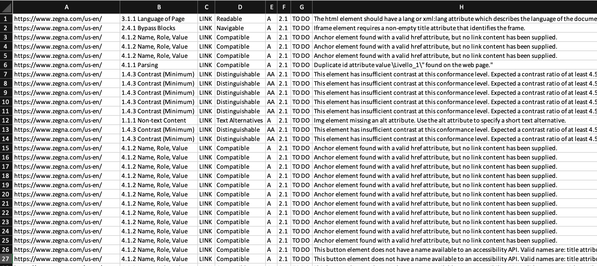
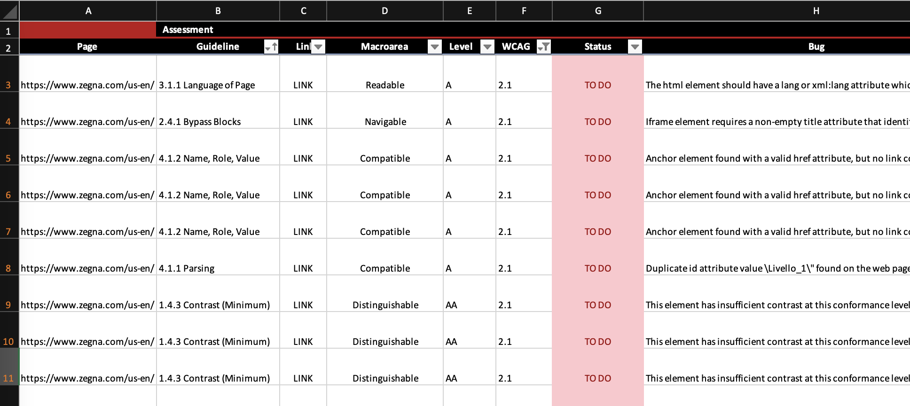

# TheA11yMachineParser

This Parser takes as input the csv output of [TheA11yMachine project](https://github.com/liip/TheA11yMachine/), obtained using the following settings
```
./a11ym  --report csv --error-level error --maximum-urls 1000  https://www.zegna.com > output.csv
```
Workers cannot be used in TheA11yMachine because the output file loses track of what URL is being analysed.

The data obtained is VERBOSE but it contains info about the page that is currently being analyzed.
This parser cleans up the data to obtain a csv that contains just the accessibility issues and the indication of the page analyzed.




In order to import the parsed file into Excel:

## Step 1
Go to the Data tab and click on Get External Data (not available on Excel online).



## Step 2
Select "Delimited" and click Next



## Step 3
Select only "Comma" and clcik Next



## Preview

Here is the data imported in Excel.



Here is the parsed data that has been formatted in Excel.
If you wish to import data in a formatted sheet, you should import data in a DIFFERENT sheet and then copy/paste it in the formatted sheet.

